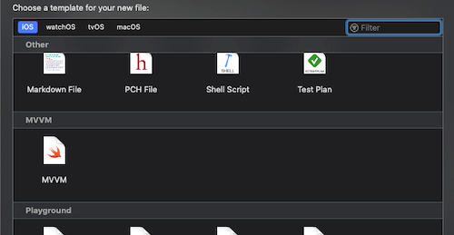

## MVVM-Coordinator example
The example in this repo is about:
    - MVVM-Coordinator pattern 
    - Group items by module
    
## Template
To install 
```bash
$ make install_templates
```

To uninstall 
```bash
$ make uninstall_templates
```
When create a new scene, please use the template:



Open .storyboard at least once to make sure Xcode fixes all the conflicts.
